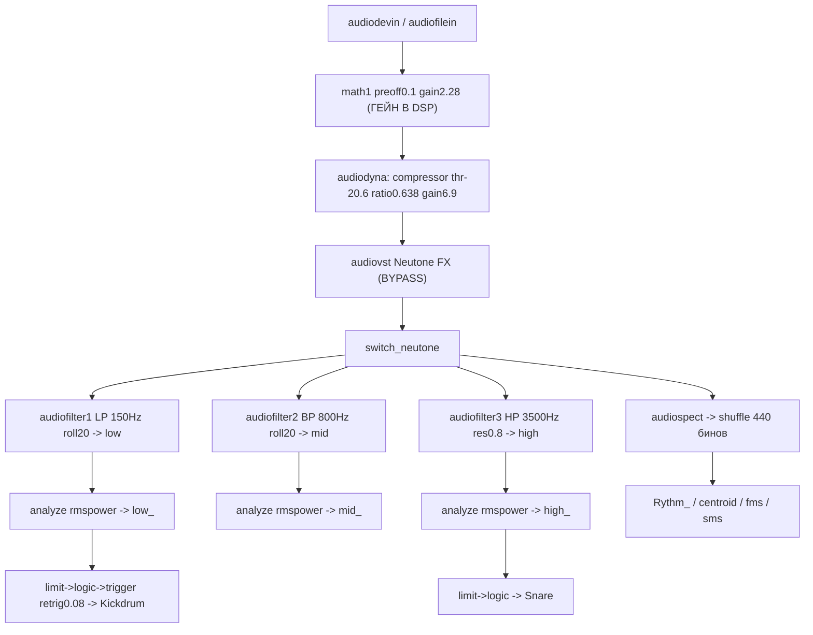
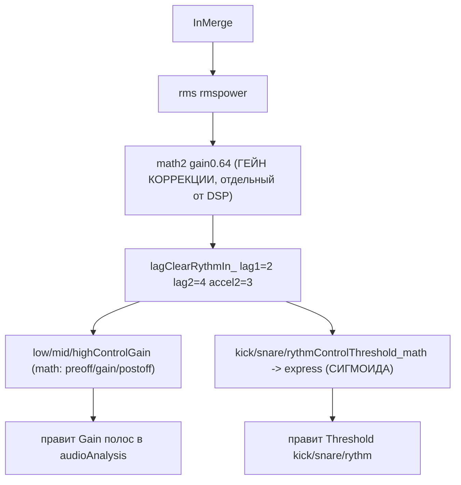

# Архитектура Rust-порта bitbybeat (аудиоанализатор → OSC)

Цель: заменить прожорливый TouchDesigner-прототип автономной Rust-тулзой с GUI (egui), аудио I/O (cpal), полуавтономным адаптивным управлением и OSC-сервером (порт 7700). Дамп `project1_dump.json` (1597 нод) реверс-инжинирится: ~60-80 нод — реальный DSP, остальное — GUI TouchDesigner.

## Что делаю
Создаю папку `md_plans/` и пишу туда 8 md-файлов (без изменения кода — это планировочные документы). Ниже — суть каждого.

## Ключевые решения (по ответам)
- Кроссплатформенно (Linux приоритет + Windows) через `cpal`.
- VST3-хостинг — заложить как опциональную будущую фичу (низкий приоритет), сейчас не реализуем; в дампе он в байпасе (`vstbypass=True`, `switch_neutone=0`).
- GUI максимально функциональный: контролы DSP + механизм адаптивного управления (сигмоида), метры, спектр, выбор устройств, опциональный мониторинг-выход.

## Разобранный сигнальный тракт (факт из дампа)

Отдельная адаптивная ветвь (полуавтономное управление):

## Файлы в md_plans/
- `00_overview.md` — цели/не-цели, стек и обоснование крейтов (`eframe/egui`, `cpal`, `rustfft`+`realfft`, `biquad`, `rosc`, `ringbuf`/`triple_buffer`, `serde`+`ron`), глоссарий TouchDesigner→Rust (CHOP=буфер каналов, math/lag/limit/trigger/analyze/audiofilter/audiospect → их DSP-эквиваленты), ограничение дампа (формулы `express` не сохранены → сигмоида задаётся параметрически).
- `01_architecture.md` — потоковая модель: RT audio-callback (cpal) → lock-free ring buffer → DSP/analysis worker (control-rate 60 Гц, как `rate:60` в дампе) → атомарный снапшот метрик → GUI (egui) и OSC-sender. Диаграммы потоков и передачи данных, backpressure, отделение аудио-rate от control-rate.
- `02_dsp_pipeline.md` — точный порт графа: source→mono(avg)→compressor(`audiodyna`)→[vst bypass]→3 биквад-фильтра (LP150/BP800/HP3500 с rolloff/resonance)→RMS по полосам→детект kick/snare (limit→logic→trigger, retrigger 0.08с)→спектр (FFT, shuffle 440 бинов)→rhythm/spectral centroid/flux. Таблица «нода TD → Rust-функция → параметры из дампа».
- `03_adaptive_control.md` — сердце тулзы: dual-gain (`math1`→DSP vs `math2`→коррекция), `lag` сглаживание, `*ControlGain`/`*ControlThreshold` как аффинные мапперы (preoff/gain/postoff/torange из дампа), конфигурируемая сигмоида (замена `express`) с настраиваемыми коэффициентами, разводка выходов в контролы DSP. Мульти-поточные контролы для файнтюна под конкретный трек.
- `04_osc_output.md` — OSC-схема: порт 7700, `timeslice`/sample-format, пост-процессоры `Low_Base`/`Mid_Base`/`High_Mid`/`Jumper_trigger`/`Zig_Zagger`/`Count_Analysis` (счётчики kick/snare по 4/8/16, zigzag, jumper), список OSC-адресов и типов, частота отправки.
- `05_gui.md` — egui layout: выбор устройств вход/выход, глобальные dual-gain, панели low/mid/high (gain/threshold/smooth/add), панели kick/snare/rythm (threshold + сигмоида-редактор с превью кривой), метры уровней, спектр-визуализатор, OSC-монитор/статус, пресеты под трек (save/load).
- `06_params_and_presets.md` — полная таблица параметров с дефолтами из дампа (частоты фильтров, компрессор, gains, retrigger, lag, limit, диапазоны math) для точного воспроизведения; модель конфигурации и сериализация пресетов (serde/ron), совместимость профилей.
- `07_project_structure.md` — раскладка крейта и модулей (`audio/`, `dsp/`, `control/`, `osc/`, `gui/`, `config/`), `Cargo.toml` зависимости, этапы реализации (MVP: вход→полосы→OSC; далее адаптив, спектр, GUI, пресеты, опц. VST) и критерии готовности.

## Риски / допущения
- Сигмоидные формулы `express` в дампе редуцированы до чисел — воспроизводим как параметрическую сигмоиду с калибровкой под слух/трек.
- Точные значения `torange`/скрытых параметров некоторых `math` берём из дампа, где присутствуют; недостающие помечаем как «подобрать при калибровке».
- `audiospect`/`shuffle 440` и spectral flux/centroid реализуем через `realfft`; численное совпадение с TD не гарантируется 1:1, но поведенчески эквивалентно.